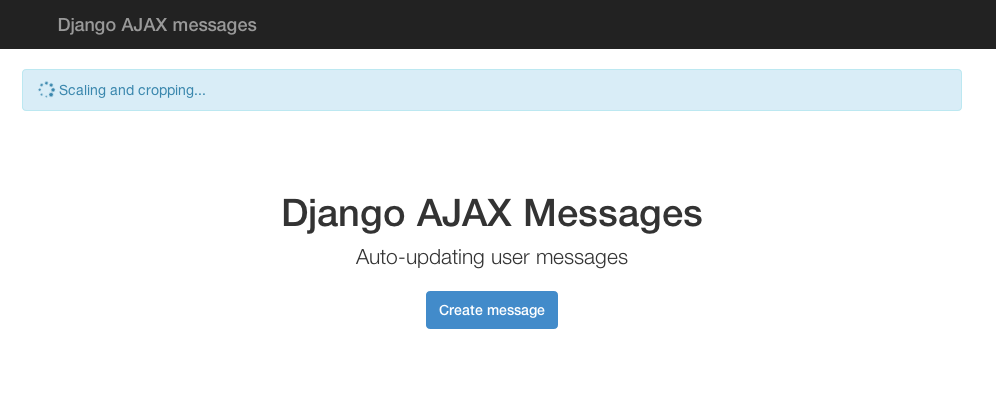

# Django AJAX Messages

**Auto-updating messages for Django.**

**Author:** Tom Christie, [Follow me on Twitter][twitter].

The `django-ajax-messages` package allows you to add auto-refreshing messages to your Django project.

This is similar to Django's `contrib.messages` application, except that once created, messages can be updated, and will automatically refresh in the browser.

#### Screenshots

**Example messaging for an in-progress operation:**

**Example messaging for an successfully completed operation:**

#### Testing

There is a simple test project included in this repository, that demostrates the usage of Django AJAX messages.  To use it clone the repository, and open a console.

    virtualenv env                # Keep everything clean by creating a fresh virtual environment.
    source env/bin/activate
    pip install requirements.txt  # Install Django
    cd testproject
    export PYTHONPATH=..          # Ensure the local copy of `ajaxmessages` is available to import.
    python ./manage.py syncdb     # Make sure you create a superuser to test with.
    python ./manage.py runserver
    
Then in a seperate window start the example `tick` management command that will asyncronously update the messages.

    source env/bin/activate
    cd testproject
    export PYTHONPATH=..
    python ./manage.py tick

Now open [http://127.0.0.1:8000]() in a browser window, login to the app, and click the 'Create message' button a few times.

#### Limitations

* Messages can only be issued to authenticated users.  There is no provision for messaging unauthenticated sessions.
* Message refreshing is currently hardcoded to 5 seconds.  This should probably be a setting.
* When pending messages refresh, the alert box is always reloading, even if nothing has changed.  This causes the spinner to jerk forward every so often instead of spinning smoothly. 
* Expired messages are currently never removed from the database.
* Displaying messages currently requires a database lookup.  Cache support would be nice.

## Installation

Install using pip:

    pip install django-ajax-messages

Add the following to your settings:

    INSTALLED_APPS = (
        ...
        'ajaxmessages',
    )

    TEMPLATE_CONTEXT_PROCESSORS = (
        ...
        'ajaxmessages.context_processors.ajaxmessages',
    )

You also need to add the messages AJAX endpoint to your URLconf:

    urlpatterns = patterns('',
        ...
        url(r'^messages/$', 'ajaxmessages.views.messages', name='ajaxmessages'),
    )

Note that the view name **must** be set to `'ajaxmessages'`.

## Creating and updating messages

Creating messages is similar to using Django `contrib.messages` framework.

    from ajaxmessages import add_message
    
    message = add_message(request.user, 'Your video is being processed...')

Once you've created a message you'll probably want to hand it over to some form of asyncronous task queue that'll run whatever ongoing job the message is associated with.

For example, using `django_rq`, you might queue a video instance and associated message using something like this:

    import django_rq
    django_rq.enqueue(run_video_processing, video=video, message=message)

Inside the task you can now update the message text:

    message.text = '...running speech recognition...'
    message.save()    

Or mark the message with a success or failure notification:

    message.status = ajaxmessages.SUCCESS
    message.save()

## Displaying messages in your templates

To include messages, add the following to any base template that
you want to display auto updating messages inside:

    

There are also a number of javascript and stylesheet requirements that you'll want to include in you base template.  The only strict external requirement is [jQuery], but you'll probably also want to include [Bootstrap] and [FontAwesome] to use the default style. 

#### Javascript requirements

You'll need to download and include [jQuery], and include in the `ajaxmessages.js` static file that's included in this package.

If you're using the default template style, and want to allow users to dismiss alerts, you'll also want to include javascript for Bootstrap.

Place the following in your base template, just before the closing `</body>` tag.

    
    
    

Download [jQuery] and [Bootstrap] and place the javascript files in your project's top level `static` folder:

     /static/js/bootstrap.js
     /static/js/jquery.js

#### Stylesheet requirements

If you're using the default template style, you'll want to include the Bootstrap CSS, as well as the fonts and styles for FontAwesome, that include the spinner icon used by the default style.

    <link href="" rel="stylesheet" media="screen">
    <link href="" rel="stylesheet">

Download [Bootstrap] and [FontAwesome] and place the stylesheets and fonts in your project's top level `static` folder:

    /static/css/bootstrap.js
    /static/css/font-awesome.css
    /static/font/FontAwesome.otf
    /static/font/fontawesome-webfont.eot
    /static/font/fontawesome-webfont.svg
    /static/font/fontawesome-webfont.ttf
    /static/font/fontawesome-webfont.woff

## Customizing the message template

You can customize how messages display by creating a template in your top level project templates directory, named `ajaxmessages/messages.html`.

You can use 

## License

Copyright © Tom Christie, DabApps.

All rights reserved.

Redistribution and use in source and binary forms, with or without 
modification, are permitted provided that the following conditions are met:

Redistributions of source code must retain the above copyright notice, this 
list of conditions and the following disclaimer.
Redistributions in binary form must reproduce the above copyright notice, this 
list of conditions and the following disclaimer in the documentation and/or 
other materials provided with the distribution.
THIS SOFTWARE IS PROVIDED BY THE COPYRIGHT HOLDERS AND CONTRIBUTORS "AS IS" AND 
ANY EXPRESS OR IMPLIED WARRANTIES, INCLUDING, BUT NOT LIMITED TO, THE IMPLIED 
WARRANTIES OF MERCHANTABILITY AND FITNESS FOR A PARTICULAR PURPOSE ARE 
DISCLAIMED. IN NO EVENT SHALL THE COPYRIGHT HOLDER OR CONTRIBUTORS BE LIABLE 
FOR ANY DIRECT, INDIRECT, INCIDENTAL, SPECIAL, EXEMPLARY, OR CONSEQUENTIAL 
DAMAGES (INCLUDING, BUT NOT LIMITED TO, PROCUREMENT OF SUBSTITUTE GOODS OR 
SERVICES; LOSS OF USE, DATA, OR PROFITS; OR BUSINESS INTERRUPTION) HOWEVER 
CAUSED AND ON ANY THEORY OF LIABILITY, WHETHER IN CONTRACT, STRICT LIABILITY, 
OR TORT (INCLUDING NEGLIGENCE OR OTHERWISE) ARISING IN ANY WAY OUT OF THE USE 
OF THIS SOFTWARE, EVEN IF ADVISED OF THE POSSIBILITY OF SUCH DAMAGE.

[twitter]: http://twitter.com/_tomchristie
[jQuery]: http://jquery.com/
[Bootstrap]: http://getbootstrap.com/
[FontAwesome]: http://fortawesome.github.io/Font-Awesome/